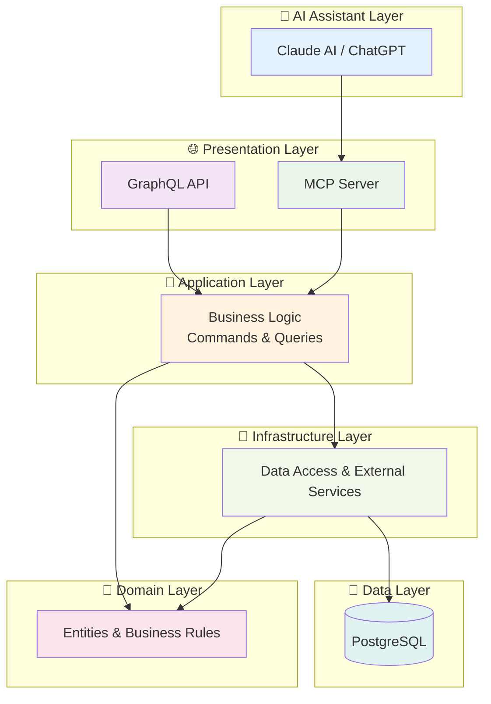
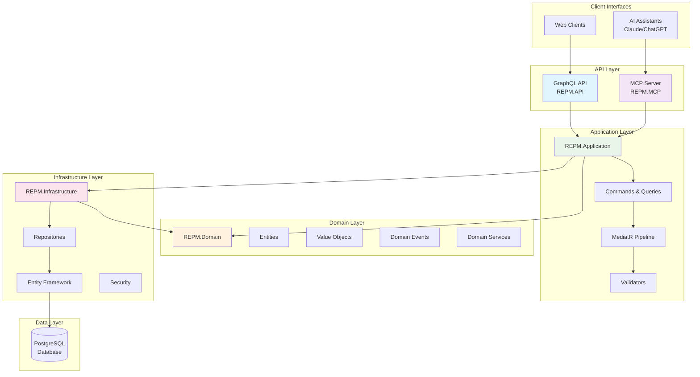
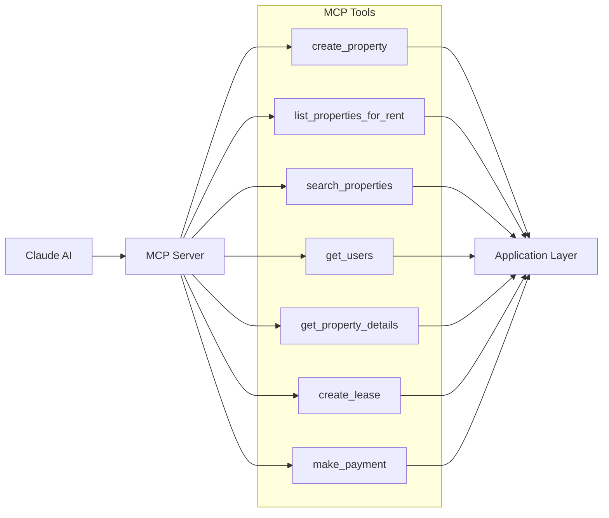
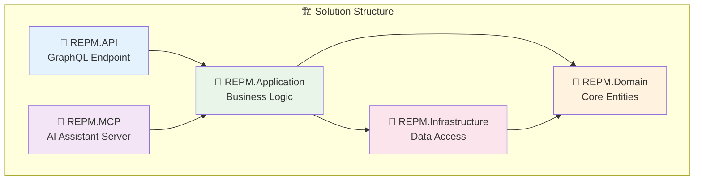
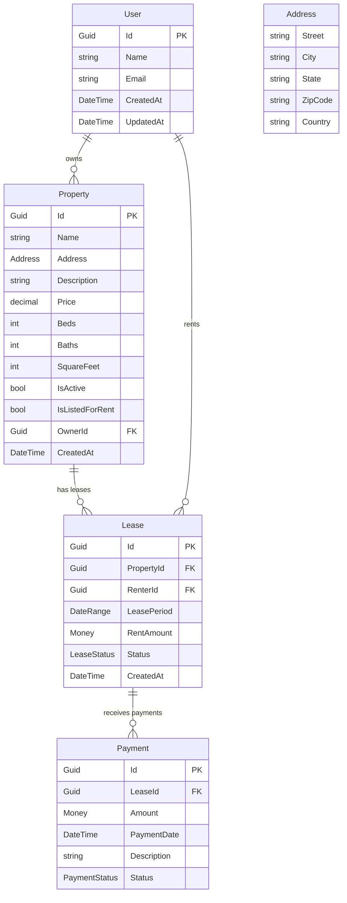
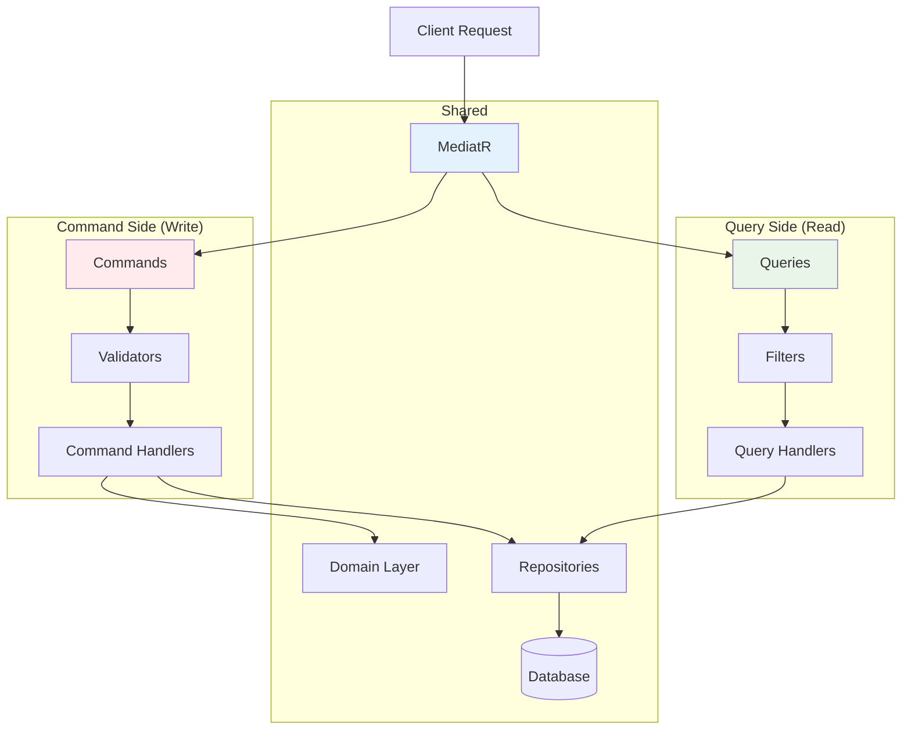

# REPM - Real Estate Property Manager 🏡

**REPM** (Real Estate Property Manager) is a comprehensive backend system built for managing real estate properties, leases, users, and related operations. This project serves as both a solid foundation for real-world property management platforms and a technical showcase of```

### 📚 Detailed Documentation Links:

- **[📘 REPM.API](./UltimateBackendStack/REPM.API/README.md)** — GraphQL setup, mutations, queries, and web API entry point 🌐
- **[📗 REPM.MCP](./UltimateBackendStack/REPM.MCP/README.md)** — Model Context Protocol server for AI assistant integration 🤖
- **[📙 REPM.Application](./UltimateBackendStack/REPM.Application/README.md)** — Commands, Queries, DTOs, and Business Logic 📁
- **[📕 REPM.Domain](./UltimateBackendStack/REPM.Domain/README.md)** — Entities, Value Objects, Domain Events, and Business Rules 📜
- **[📔 REPM.Infrastructure](./UltimateBackendStack/REPM.Infrastructure/README.md)** — Repositories, DbContext, and external integrations 🔌ed software architecture patterns. 🌟

The system provides multiple interfaces including a **GraphQL API** and a **Model Context Protocol (MCP) server** for seamless integration with AI assistants like Claude.

## 🏗️ Basic Architecture

REPM follows **Clean Architecture** principles with clear separation of concerns across multiple layers:



## 🛠️ Technologies & Patterns

This project showcases modern .NET backend architecture using:

- **.NET 9** 🖥️
- **GraphQL using HotChocolate** 🍫
- **Model Context Protocol (MCP) for AI assistant integration** 🤖
- **Domain-Driven Design (DDD) to model complex real-world behaviors** 🌍
- **Clean Architecture to keep concerns separated and maintainable** 🧩
- **CQRS (Command Query Responsibility Segregation) to separate read/write operations** 📊
- **Mediator Pattern via MediatR for decoupling command and query handling** 🔄
- **Repository Pattern for abstracting data access** 📂
- **Unit of Work Pattern to manage transactional consistency** ⚖️
- **PostgreSQL as the primary database** 🐘
- **Entity Framework Core for data access** 📊
- **AutoMapper for object-to-object mapping** 🗺️

## 🎯 Goal of This Project

The main goal of REPM is to put into practice advanced architectural patterns and serve as a **template** or **starting point** for robust backend systems. It aims to balance maintainability, scalability, and domain expressiveness while embracing .NET's powerful ecosystem. 💪

## 🔧 Basic Use Cases

1️⃣ **Property Listing**: A property owner lists a property for rent  
2️⃣ **Property Search**: A renter searches for available properties with filters  
3️⃣ **Lease Creation**: The renter requests to lease a property  
4️⃣ **Lease Management**: The lease is created with valid start & end dates  
5️⃣ **Payment Processing**: The renter makes monthly payments  
6️⃣ **Property Management**: Owner can unlist properties when no longer available  
7️⃣ **AI Integration**: Natural language property management through Claude AI  

## 🛠️ Getting Started

### Prerequisites
- .NET 9 SDK
- PostgreSQL database
- (Optional) Claude AI for MCP integration

### Running the GraphQL API
```bash
cd REPM.API
dotnet run
```

### Running the MCP Server
```bash
cd REPM.MCP
dotnet run
```

### Sample GraphQL Queries

**Get properties in a specific city:**
```graphql
query {
  propertiesForRent(filters: { city: "Buenos Aires" }) {
    edges {
      node {
        id
        name
        address {
          city
          state
        }
        price
        beds
        baths
      }
    }
  }
}
```

**Create a new property:**
```graphql
mutation {
  createProperty(input: {
    name: "Downtown Condo"
    description: "Beautiful condo in the city center"
    price: 2500
    beds: 2
    baths: 2
    squareFeet: 1200
    ownerId: "owner-guid-here"
    address: {
      street: "123 Main St"
      city: "Buenos Aires"
      state: "BA"
      zipCode: "1000"
    }
  }) {
    property {
      id
      name
    }
  }
}
```
r real-world property management platforms and a technical showcase of advanced software architecture patterns. 🌟

The system provides multiple interfaces including a **GraphQL API** and a **Model Context Protocol (MCP) server** for seamless integration with AI assistants like Claude.

## 🧠 Overview of the System

The REPM system provides a comprehensive solution for managing real estate assets, facilitating interactions between users, properties, and leases through multiple interfaces:

- **GraphQL API** - Full-featured web API with advanced querying capabilities
- **MCP Server** - AI assistant integration for natural language property management
- **Clean Architecture** - Modular, maintainable, and testable codebase

The system utilizes modern technologies to ensure efficient data handling and robust architecture, making it suitable for both development and production environments. 🚀

## 🏗️ System Architecture



## 🔧 Technologies and Patterns Used

This project is structured around modern .NET backend principles and architecture patterns:

- **.NET 9** 🖥️
- **GraphQL** using HotChocolate 🍫
- **Model Context Protocol (MCP)** for AI assistant integration 🤖
- **Domain-Driven Design (DDD)** to model complex real-world behaviors 🌍
- **Clean Architecture** to keep concerns separated and maintainable 🧩
- **CQRS (Command Query Responsibility Segregation)** to separate read/write operations 📊
- **Mediator Pattern** via MediatR for decoupling command and query handling 🔄
- **Repository Pattern** for abstracting data access 📂
- **Unit of Work Pattern** to manage transactional consistency ⚖️
- **PostgreSQL** as the primary database 🐘
- **Entity Framework Core** for data access 📊
- **AutoMapper** for object-to-object mapping 🗺️

## 🌐 Available Interfaces

### GraphQL API
- **Endpoint**: `/graphql`
- **Features**: Queries, Mutations, Pagination, Filtering
- **Use Case**: Web applications, mobile apps, direct API consumption

### MCP Server
- **Protocol**: JSON-RPC over stdin/stdout
- **Features**: Natural language property management through AI assistants
- **Use Case**: Claude AI integration, conversational property management
- **Tools Available**:
  - Create properties
  - List properties for rent
  - Search properties with filters
  - Manage users and leases
  - Process payments



## 📦 Project Structure & Documentation

This solution is organized into several projects to enforce clear separation of concerns. Each project contains its own detailed `README.md` with specific implementation details:



- **`REPM.API`** — GraphQL setup and web API entry point 🌐
- **`REPM.MCP`** — Model Context Protocol server for AI assistant integration 🤖
- **`REPM.Application`** — Commands, Queries, DTOs, and Business Logic 📁
- **`REPM.Domain`** — Entities, Value Objects, Domain Events, and Business Rules �
- **`REPM.Infrastructure`** — Repositories, DbContext, and external integrations 🔌

## 🏢 Domain Model



## 🎯 Goal of This Project

The main goal of REPM is to put into practice advanced architectural patterns and serve as a **template** or **starting point** for robust backend systems. It aims to balance maintainability, scalability, and domain expressiveness while embracing .NET's powerful ecosystem. 💪

## 🚀 Basic Use Cases

1️⃣ A property owner lists a property for rent.  
2️⃣ A renter requests to lease a property.  
3️⃣ The lease is created with a valid start & end date.  
4️⃣ The renter makes a payment.  
5️⃣ The system ensures no overdue payments.  
6️⃣ An owner unlists a property if it’s no longer available.  

## 🤖 MCP Integration with Claude AI

The REPM system includes a Model Context Protocol (MCP) server that enables seamless integration with AI assistants like Claude. Users can manage properties using natural language:

**Example AI Conversations:**
- *"Create a new property in Buenos Aires with 3 bedrooms"*
- *"Show me all properties available for rent in Los Angeles"*
- *"Create a lease for the downtown condo starting next month"*
- *"Record a payment of $2500 for lease ID xyz"*

### MCP Tools Available:
- `create_property` - Add new properties to the system
- `list_properties_for_rent` - Browse available rental properties
- `search_properties` - Advanced property search with filters
- `get_users` - List all users in the system
- `get_property_details` - Get detailed property information
- `create_lease` - Establish new lease agreements
- `make_payment` - Record lease payments

## 🏛️ CQRS Architecture Flow



---

> For implementation details and logic behind each layer, check the `README.md` inside each project folder. The detailed logic will be explained in each individual project's README. 📚
