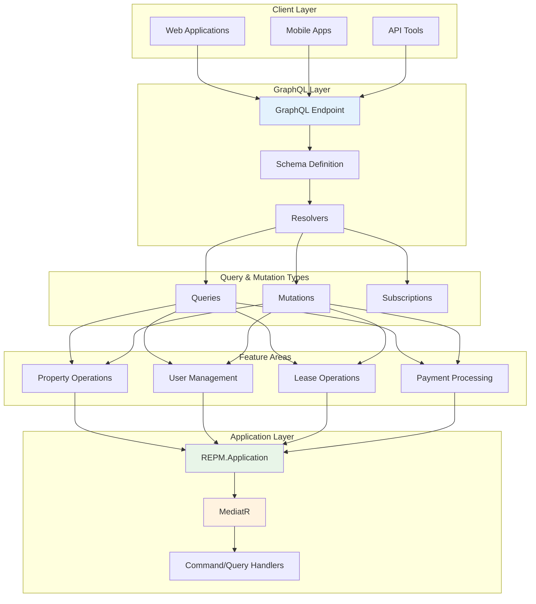
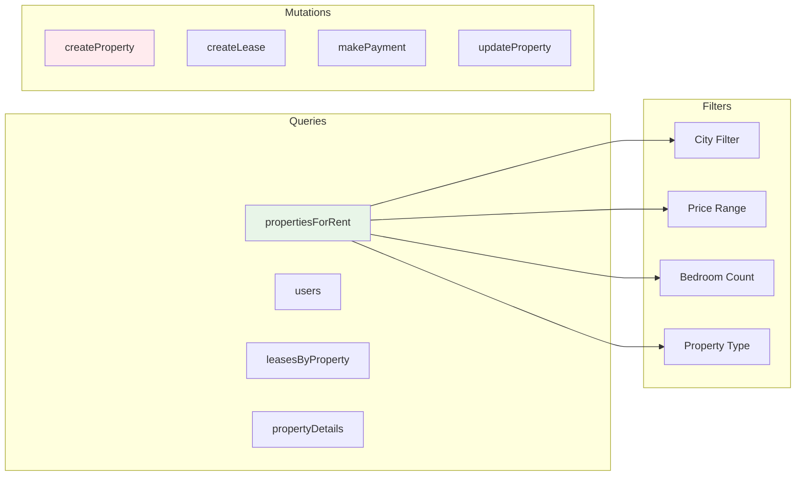
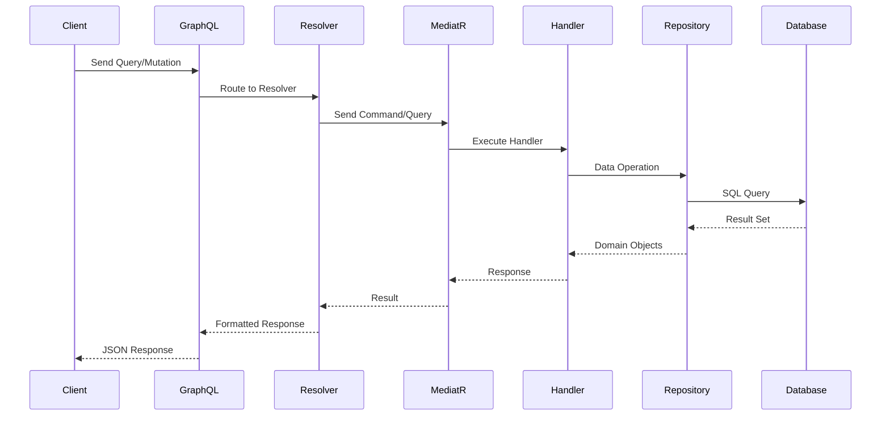
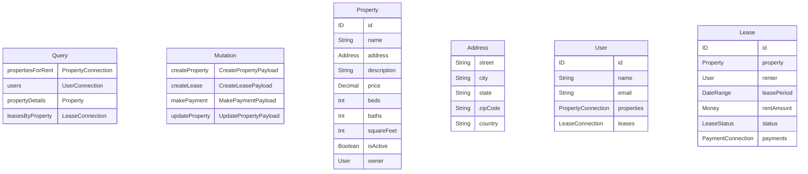

# 🌐 REPM.API - GraphQL Gateway

The **REPM.API** project serves as the GraphQL gateway for the Real Estate Property Manager (REPM) system. Built with **HotChocolate**, it provides a modern, type-safe, and efficient API for managing real estate properties, leases, users, and payments.

## 🏗️ GraphQL Architecture



## 🔧 Features

### GraphQL Capabilities
- **Type-safe queries** with strong schema validation
- **Real-time subscriptions** for live updates
- **Advanced filtering** with HotChocolate filtering
- **Automatic pagination** support
- **Field selection** for optimized data fetching
- **Error handling** with detailed error responses

### Available Operations



## 🚀 Request Flow



## 📊 Schema Structure



## 🔍 Example Queries

### Get Properties with Filtering
```graphql
query GetPropertiesInCity {
  propertiesForRent(
    filters: { 
      city: "Buenos Aires"
      minPrice: 1000
      maxPrice: 3000
      minBedrooms: 2
    }
    first: 10
  ) {
    edges {
      node {
        id
        name
        address {
          street
          city
          state
        }
        price
        beds
        baths
        owner {
          name
          email
        }
      }
    }
    pageInfo {
      hasNextPage
      endCursor
    }
  }
}
```

### Create New Property
```graphql
mutation CreateProperty {
  createProperty(input: {
    name: "Downtown Loft"
    description: "Modern loft in city center"
    price: 2500
    beds: 2
    baths: 2
    squareFeet: 1200
    ownerId: "user-id-here"
    address: {
      street: "123 Main St"
      city: "Buenos Aires"
      state: "BA"
      zipCode: "1000"
    }
  }) {
    property {
      id
      name
      address {
        city
      }
    }
    errors {
      message
      code
    }
  }
}
```

## 🛠️ Development Setup

### Prerequisites
- .NET 9 SDK
- PostgreSQL database
- REPM.Application and REPM.Infrastructure projects

### Running the API
```bash
cd REPM.API
dotnet run
```

### GraphQL Playground
Access the GraphQL Playground at: `http://localhost:5000/graphql`

## 🧪 Testing

### Unit Testing
```bash
dotnet test
```

### Integration Testing
The API includes integration tests for:
- GraphQL schema validation
- Query execution
- Mutation operations
- Error handling

## 📈 Performance Features

- **DataLoader** pattern for efficient data fetching
- **Projection** to select only requested fields
- **Pagination** to handle large result sets
- **Caching** for frequently accessed data
- **Connection pooling** for database efficiency

## 🔐 Security

- **Input validation** on all mutations
- **Authorization** filters for protected operations
- **Rate limiting** to prevent abuse
- **CORS** configuration for cross-origin requests

---

The REPM.API serves as a powerful, flexible gateway that leverages GraphQL's strengths while maintaining clean architecture principles and optimal performance.