# 🧠 REPM.Domain

The **REPM.Domain** project is the core of the Real Estate Property Manager system and follows the principles of **Domain-Driven Design (DDD)** and **Clean Architecture**. This layer encapsulates all the **business rules**, **domain models**, and **invariants**, ensuring that the application remains flexible, testable, and maintainable.

## 🏗️ Domain Architecture

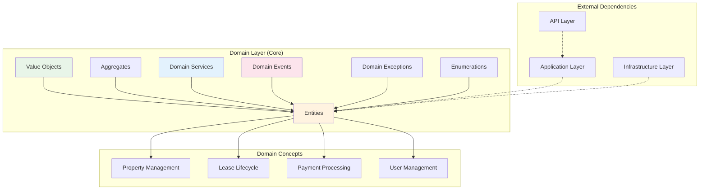

---

## 🏗️ Clean Architecture & DDD Principles

- **Independence**: This layer has no dependencies on external technologies, frameworks, or infrastructure.
- **Rich Domain Model**: Business logic lives inside the domain models (Entities, Aggregates, and Value Objects).
- **Separation of Concerns**: Use Cases and Infrastructure are not part of this layer.
- **Ubiquitous Language**: The domain code reflects the language of real estate professionals (e.g., Lease, Property, Payment).

## 🏢 Domain Model Structure

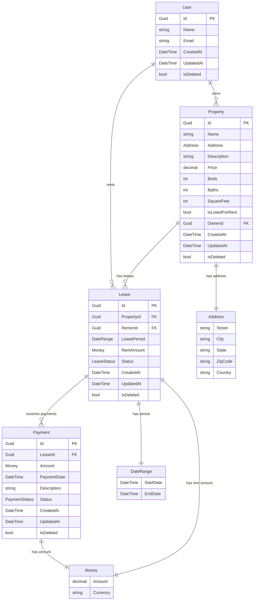

---

## 🧱 Entities & Aggregates

### 🏠 `Property`

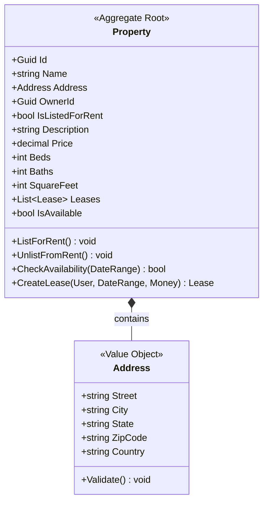

- Aggregate Root
- Holds property data: name, address, owner ID
- Can be listed/unlisted for rent
- Can check availability for a date range

### 📜 `Lease`

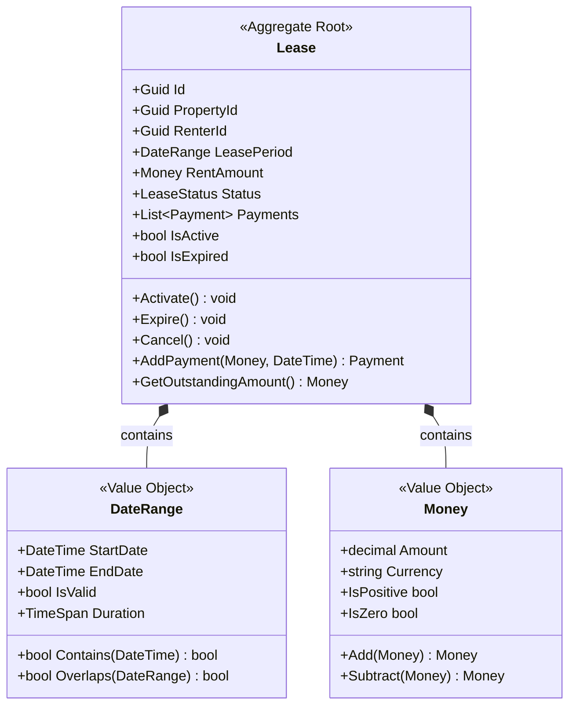

- Aggregate Root
- Represents rental agreements
- Ensures valid start/end dates
- Maintains `LeaseStatus` (Pending, Active, Expired, Canceled)

### 💳 `Payment`

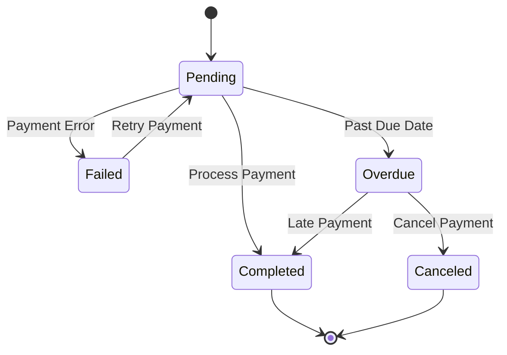

- Linked to a `Lease`
- Validates payment timing and amount
- Tracks `PaymentStatus` (Pending, Completed, Failed, Overdue, Canceled)

### 👤 `User`
- Represents both renters and property owners
- Holds basic identity info

---

## 🧱 Value Objects

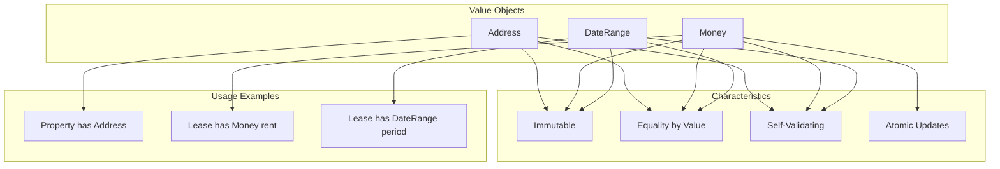

### 🏠 `Address`
- Composed of street, city, state, and zip code
- Immutable and used inside `Property`

### 💵 `Money`
- Represents a currency + value pair
- Prevents invalid money states

### 📆 `DateRange`
- Enforces a valid time period
- Used in `Lease` to represent rental duration

---

## 🧩 Enums

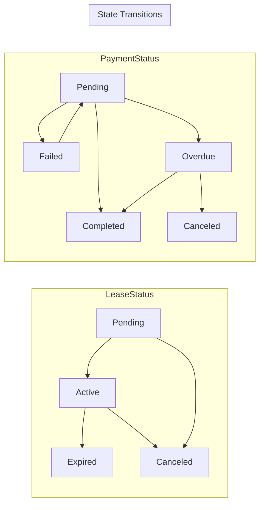

### `LeaseStatus`
- `Pending`, `Active`, `Expired`, `Canceled`

### `PaymentStatus`
- `Pending`, `Completed`, `Failed`, `Overdue`, `Canceled`

---

## 💥 Domain Events

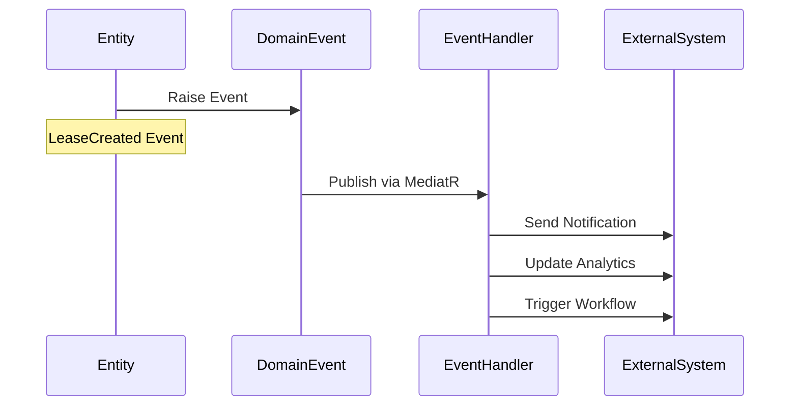

### `LeaseCreated`
- Raised when a new lease is established

### `PaymentReceived`
- Triggered when a payment is recorded

### `PropertyListedForRent`
- Raised when a property is marked available for rent

> Events are implemented using `IDomainEvent` and published via `IMediator`.

---

## 🧰 Domain Exceptions

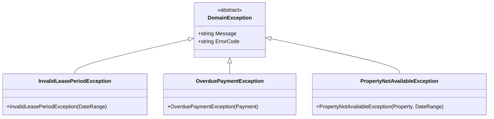

- `InvalidLeasePeriodException`
- `OverduePaymentException`
- `PropertyNotAvailableException`

These exceptions enforce domain invariants and prevent invalid state transitions.

---

## 🧠 Domain Services

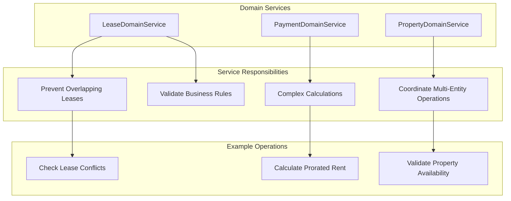

### `LeaseDomainService`
- Encapsulates domain logic that doesn't naturally fit into a single entity
- Example: prevents overlapping leases on the same property

---

## 🧪 Testing the Domain

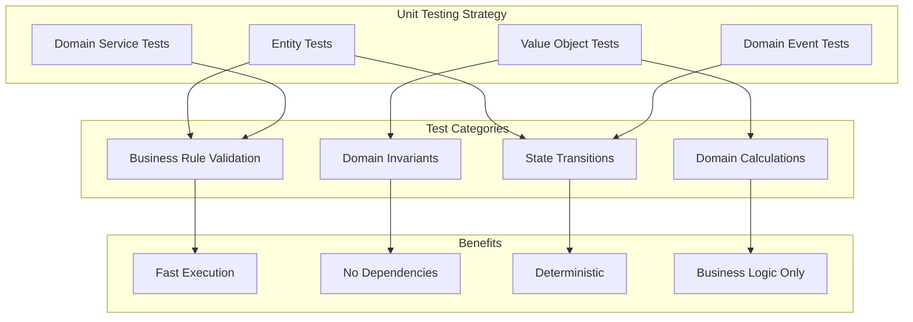

Because the domain layer has no external dependencies, it is highly testable. Business rules can be validated through unit tests targeting the entities and services directly.

---

## 📦 Folder Structure

```
REPM.Domain/
├── Entities/
│   ├── Property.cs
│   ├── User.cs
│   ├── Lease.cs
│   ├── Payment.cs
│   └── BaseEntity.cs
├── ValueObjects/
│   ├── Address.cs
│   ├── Money.cs
│   └── DateRange.cs
├── Enums/
│   ├── LeaseStatus.cs
│   └── PaymentStatus.cs
├── DomainEvents/
│   ├── LeaseCreated.cs
│   ├── PaymentReceived.cs
│   └── PropertyListedForRent.cs
├── DomainExceptions/
│   ├── InvalidLeasePeriodException.cs
│   ├── OverduePaymentException.cs
│   └── PropertyNotAvailableException.cs
├── DomainServices/
│   └── LeaseDomainService.cs
└── Interfaces/
    └── IDomainEvent.cs
```

---

## 🧭 Summary

The domain layer models the **heart of the REPM system**. By adhering to **DDD** and **Clean Architecture**, we ensure the system is robust, expressive, and adaptable to future changes — all while keeping the core logic protected from external concerns.
