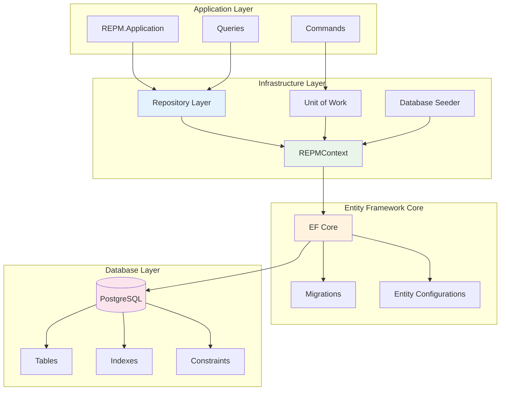
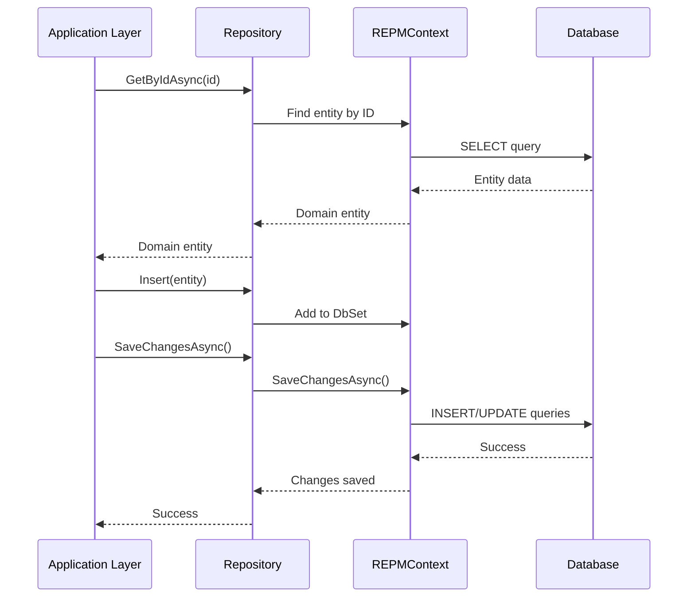
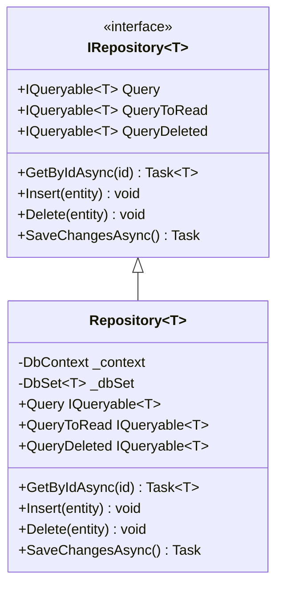
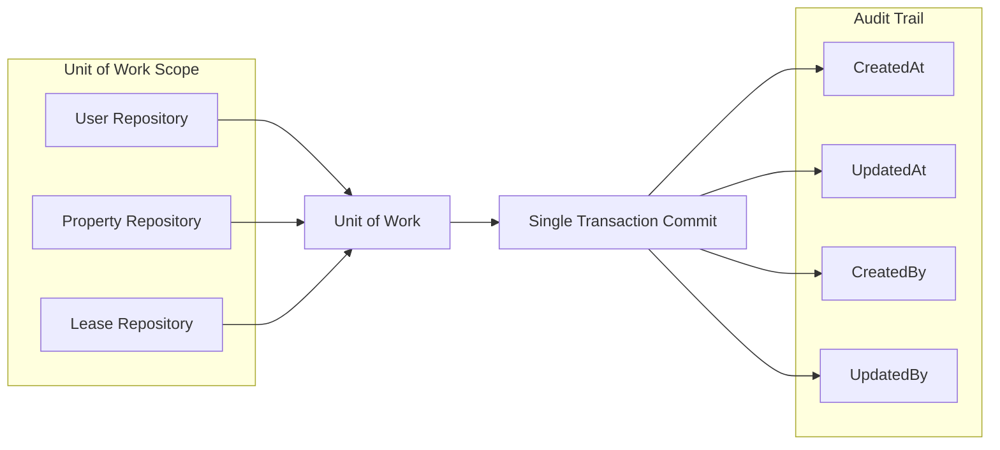
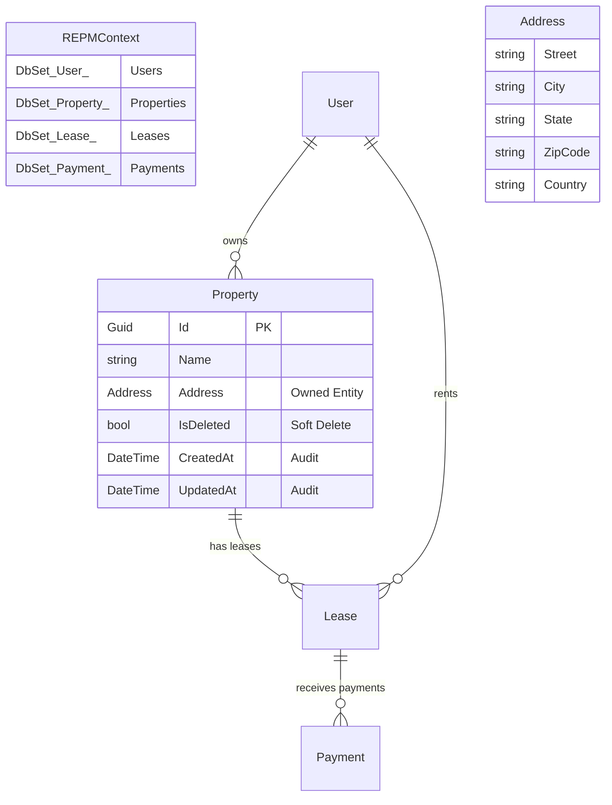
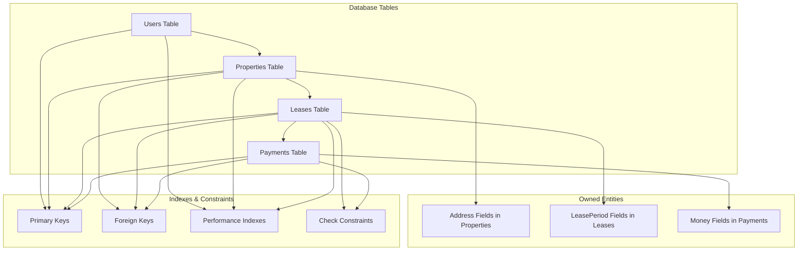
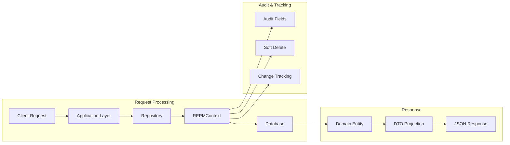

# 🏗️ REPM.Infrastructure

The **REPM.Infrastructure** project is responsible for implementing data access, persistence, and external integrations for the Real Estate Property Manager (REPM) system. It leverages **Entity Framework Core** and follows architectural patterns like the **Repository Pattern** and the **Unit of Work Pattern** to enforce clean separation of concerns and ensure the domain layer remains persistence-agnostic.

## 🏛️ Infrastructure Architecture



---

## 📦 What This Project Contains

- `REPMContext` (EF Core `DbContext`)
- Generic `Repository<TEntity>` implementation
- Interfaces for `IRepository<TEntity>` and `IUnitOfWork`
- Entity configurations and value object ownership setup
- Database seeding and migrations
- Security and audit tracking

## 🔄 Repository Pattern Flow



---

## 🧩 Repository Pattern

The **Repository Pattern** provides a consistent abstraction over data access. It encapsulates querying and persistence logic, allowing the rest of the application to work with a simple interface for interacting with data.

### ✅ `Repository<TEntity>` Highlights:



- Works with any entity that inherits from `BaseEntity`
- Exposes three query options:
  - `Query` — entities that are not deleted
  - `QueryToRead` — same as above, but without change tracking
  - `QueryDeleted` — soft-deleted entities
- Implements common CRUD operations:
  - `GetByIdAsync`, `Insert`, `Delete`, `AddRange`, `DeleteRange`
- Tracks soft deletes via the `IsDeleted` flag
- Automatically wires up `DbContext` and `DbSet<TEntity>`

Example usage in application layer:
```csharp
var user = await _userRepository.GetByIdAsync(userId);
_repository.Delete(user);
await _repository.SaveChangesAsync();
```

---

## 🧾 Unit of Work Pattern

The **Unit of Work Pattern** ensures that a series of operations across multiple repositories can be committed as a single transaction.



### ✅ `REPMContext` Implements `IUnitOfWork`

The `SaveChangesAsync()` method in `REPMContext`:

- Automatically fills in `CreatedAt`, `UpdatedAt`, `CreatedBy`, and `UpdatedBy` fields
- Accesses the current user from `IHttpContextAccessor` for audit tracking
- Applies entity state logic before committing

This allows any repository to access `UnitOfWork.SaveChangesAsync()` and commit changes safely and consistently.

---

## 🧠 REPMContext Overview



`REPMContext` is the Entity Framework `DbContext` and includes:

- Entity sets: `Users`, `Properties`, `Leases`, `Payments`
- Configuration of **owned types** like:
  - `Address` inside `Property`
  - `LeasePeriod` and `RentAmount` inside `Lease`
  - `Amount` inside `Payment`
- Relationships between entities with proper `OnDelete(DeleteBehavior.Cascade)`
- Soft-delete handling via `BaseEntity.IsDeleted`

The context serves as the central point of coordination between domain models and the database.

## 🗄️ Database Schema



---

## 🗂️ Folder Structure

```
REPM.Infrastructure/
├── Persistence/
│   ├── REPMContext.cs
│   └── Seeding/
│       └── DatabaseSeeder.cs
├── Repositories/
│   └── Repository.cs
├── Interfaces/
│   ├── IRepository.cs
│   └── IUnitOfWork.cs
├── Security/
│   └── AuditableEntityConfiguration.cs
└── Migrations/
    └── [EF Core Migrations]
```

## 🔄 Data Flow Lifecycle



1. Application calls a repository method (e.g., `Insert`, `Delete`, `GetByIdAsync`)
2. The repository interacts with `REPMContext`
3. `REPMContext.SaveChangesAsync()` processes audit info and commits
4. Domain layer remains decoupled from persistence logic

---

This infrastructure layer ensures that the rest of the application remains **clean, focused, and persistence-agnostic**, staying true to the principles of **Clean Architecture** and **DDD**.
