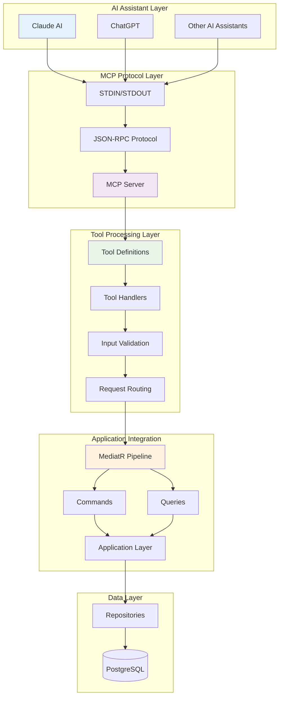
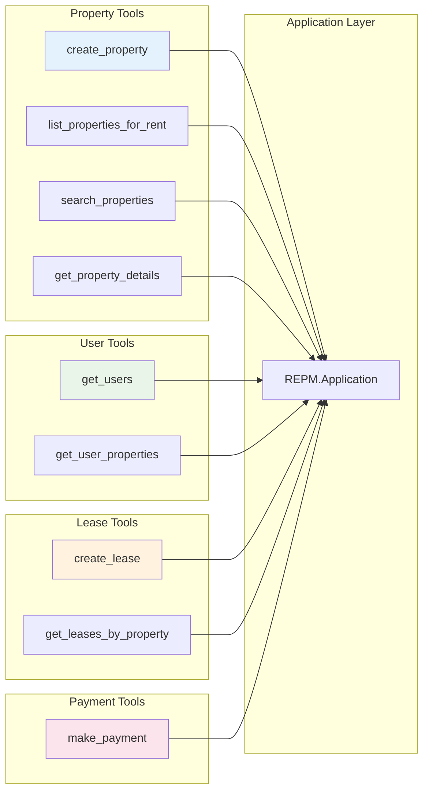
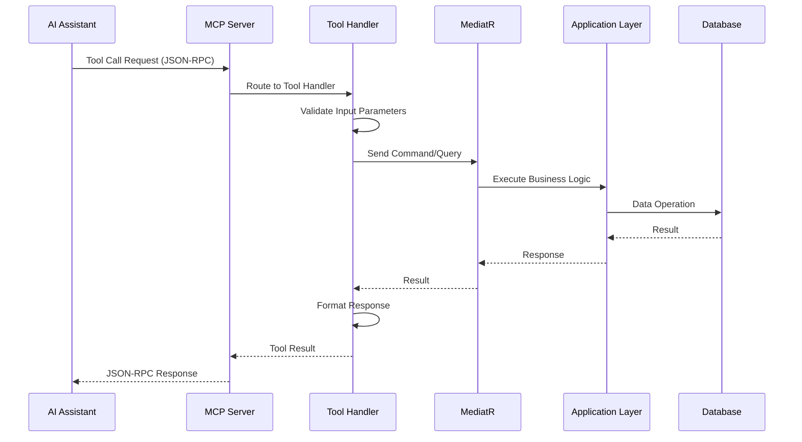
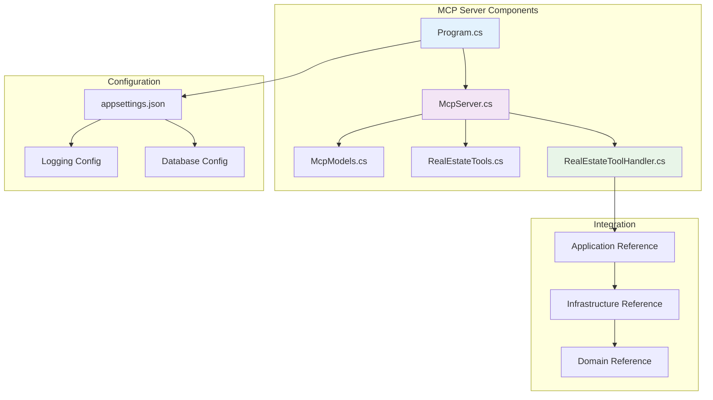
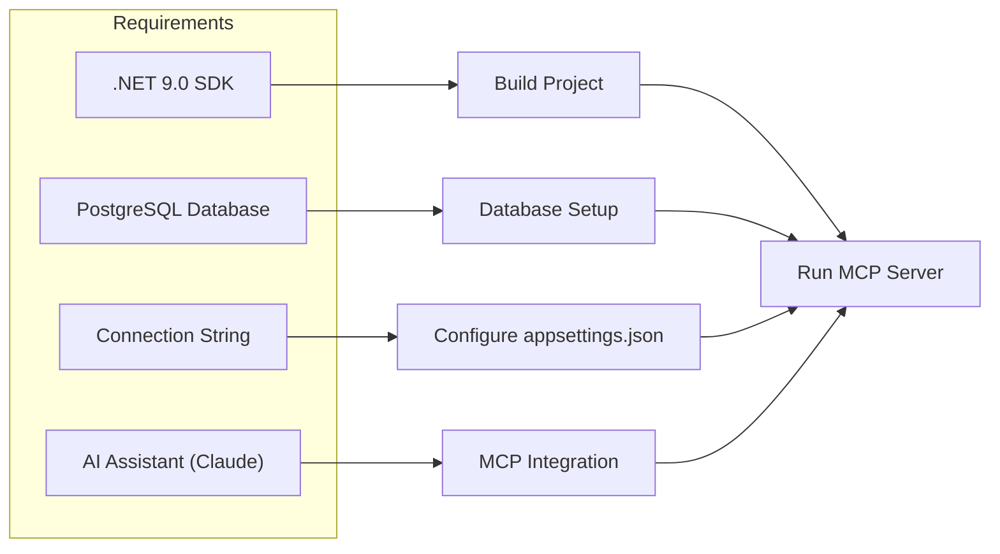
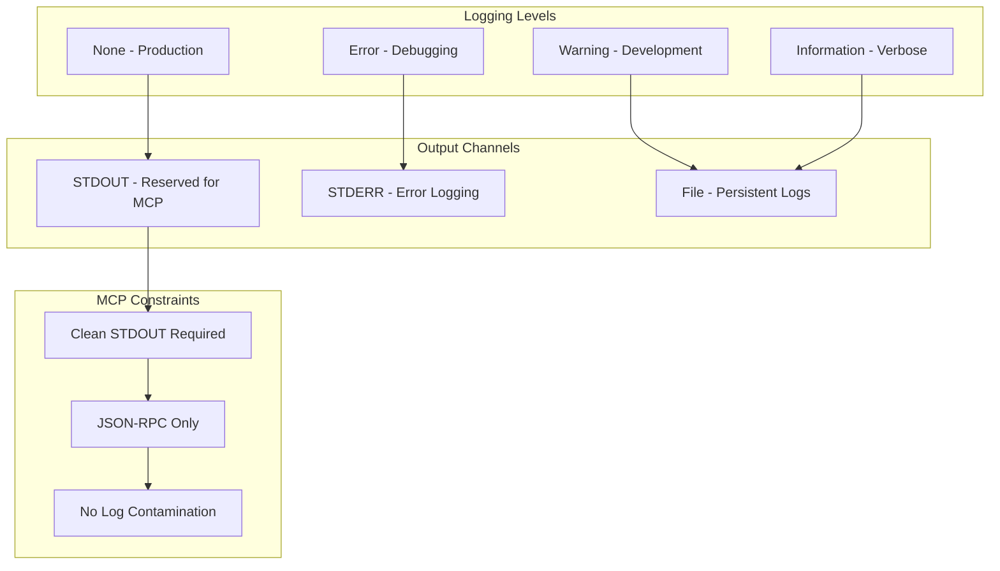
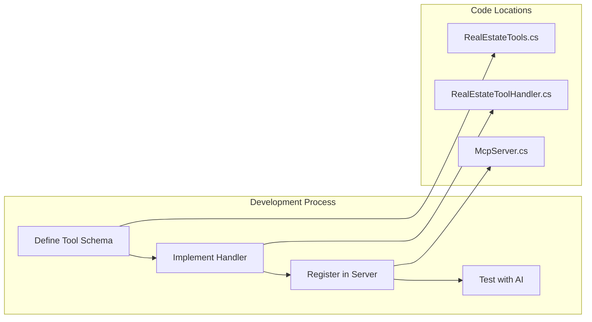
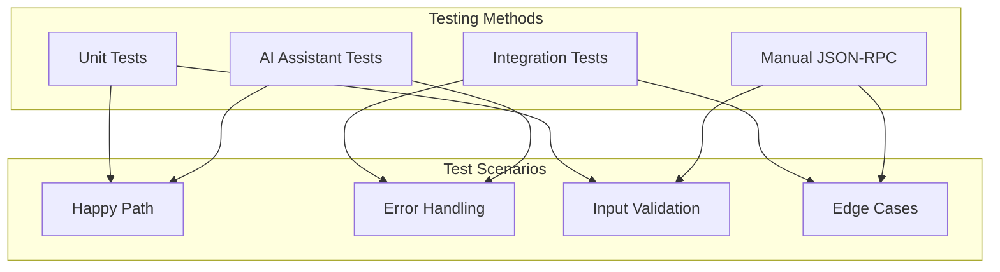
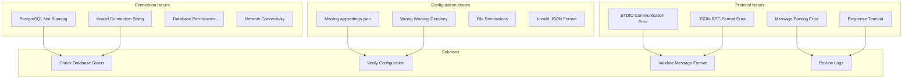
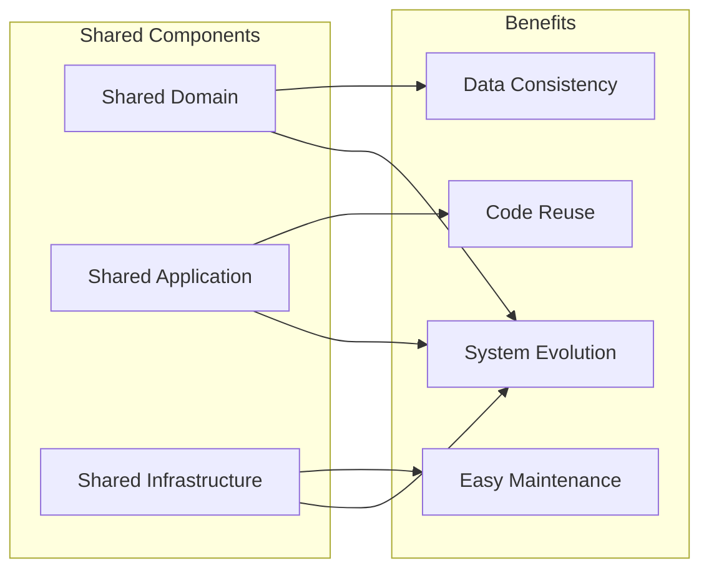

# 🤖 REPM MCP Server

The Real Estate Property Management (REPM) Model Context Protocol (MCP) Server exposes real estate management tools for AI assistants using the .NET MCP SDK. This server enables natural language interaction with the REPM system through AI assistants like Claude.

## 🏗️ MCP Architecture



## 🚀 Overview

This MCP server provides AI assistants with tools to interact with the real estate property management system, including:

- **Property Management** - Create, list, and search properties
- **User Management** - Retrieve and manage user information
- **Lease Operations** - Create and manage lease agreements
- **Payment Processing** - Record and track lease payments
- **Advanced Search** - Filter properties with multiple criteria

## 🛠️ Available Tools



### 🏠 Property Management Tools

1. **`create_property`** - Add new properties to the system
   - Input: name, description, price, beds, baths, squareFeet, address, ownerId
   - Output: Property ID and success confirmation

2. **`list_properties_for_rent`** - Browse available rental properties
   - Input: Optional filters (city, price range, bedrooms, etc.)
   - Output: List of available properties with details

3. **`search_properties`** - Advanced property search with multiple criteria
   - Input: Complex filter combinations
   - Output: Filtered property results

4. **`get_property_details`** - Get detailed information about a specific property
   - Input: Property ID
   - Output: Complete property information including owner details

### 👥 User Management Tools

5. **`get_users`** - List all users in the system
   - Input: None
   - Output: List of all users with basic information

6. **`get_user_properties`** - Get properties owned by a specific user
   - Input: User ID
   - Output: List of properties owned by the user

### 📋 Lease Management Tools

7. **`create_lease`** - Create new lease agreements
   - Input: propertyId, tenantId, startDate, endDate, monthlyRent, currency
   - Output: Lease ID and confirmation

8. **`get_leases_by_property`** - Get all leases for a specific property
   - Input: Property ID
   - Output: List of leases with details and payment history

### 💰 Payment Processing Tools

9. **`make_payment`** - Record lease payments
   - Input: leaseId, amount, currency, paymentDate, description
   - Output: Payment confirmation and receipt details

## 🔄 Request Processing Flow



## 🎯 Natural Language Examples

The MCP server enables natural language interaction through AI assistants:

### Property Creation
**User**: *"Create a property in Buenos Aires with 3 bedrooms, 2 bathrooms, 1500 square feet, priced at $2800 per month"*

**AI Response**: Uses `create_property` tool with extracted parameters

### Property Search
**User**: *"Show me all properties available for rent in Los Angeles under $3000 with at least 2 bedrooms"*

**AI Response**: Uses `list_properties_for_rent` with filters

### Lease Management
**User**: *"Create a one-year lease starting January 1st for the downtown condo, tenant ID abc123, monthly rent $2500"*

**AI Response**: Uses `create_lease` tool with date calculations

## 🏗️ Architecture Components



### Core Components

- **Models**: JSON-RPC request/response models for MCP communication
- **Tools**: Tool definitions and parameter schemas
- **Handlers**: Business logic for processing tool requests
- **Server**: STDIO-based MCP server implementation

## 🚀 Quick Start

### Prerequisites



- .NET 9.0 SDK
- PostgreSQL database (same as main API)
- Valid connection string in `appsettings.json`
- AI assistant with MCP support (Claude recommended)

### Running the Server

```bash
# Option 1: Use the provided script
./run-mcp.sh

# Option 2: Manual steps
dotnet build
cd bin/Debug/net9.0
./REPM.MCP

# Option 3: Development mode
dotnet run
```

### VS Code Integration

The server includes VS Code configuration for easy testing and development:

1. Use **F5** to run with debugging
2. Set breakpoints in tool handlers
3. Monitor STDIO communication in the terminal

## ⚙️ Configuration

### Database Connection

Update `appsettings.json` with your PostgreSQL connection:

```json
{
  "ConnectionStrings": {
    "WebApiDatabase": "Host=localhost;Port=5432;Database=realestatetest;Username=omar;Password=rootroot"
  }
}
```

### Logging Configuration



Logging is configured for minimal output suitable for MCP STDIO communication:

```json
{
  "Logging": {
    "LogLevel": {
      "Default": "None",
      "Microsoft": "None",
      "Microsoft.Hosting.Lifetime": "None"
    }
  }
}
```

## 🧪 Tool Usage Examples

### Create Property Example

```json
{
  "method": "tools/call",
  "params": {
    "name": "create_property",
    "arguments": {
      "name": "Downtown Loft",
      "description": "Modern loft in city center",
      "price": 2800,
      "beds": 2,
      "baths": 2,
      "squareFeet": 1400,
      "ownerId": "owner-uuid-here",
      "address": {
        "street": "123 Main Street",
        "city": "Buenos Aires",
        "state": "BA",
        "zipCode": "1000"
      }
    }
  }
}
```

### Search Properties Example

```json
{
  "method": "tools/call",
  "params": {
    "name": "list_properties_for_rent",
    "arguments": {
      "city": "Los Angeles",
      "minPrice": 1500,
      "maxPrice": 3000,
      "minBedrooms": 2,
      "maxBedrooms": 4
    }
  }
}
```

### Create Lease Example

```json
{
  "method": "tools/call",
  "params": {
    "name": "create_lease",
    "arguments": {
      "propertyId": "property-uuid-here",
      "tenantId": "tenant-uuid-here",
      "startDate": "2024-01-01",
      "endDate": "2024-12-31",
      "monthlyRent": 2500,
      "currency": "USD"
    }
  }
}
```

## 🔧 Development

### Project Structure

```
REPM.MCP/
├── Models/           # MCP protocol models
│   └── McpModels.cs
├── Tools/            # Tool definitions and schemas  
│   └── RealEstateTools.cs
├── Handlers/         # Business logic for tools
│   └── RealEstateToolHandler.cs
├── Server/           # MCP server implementation
│   └── McpServer.cs
├── Program.cs        # Application entry point
├── appsettings.json  # Configuration
└── run-mcp.sh       # Convenience script
```

### Adding New Tools



1. Define tool schema in `Tools/RealEstateTools.cs`
2. Implement handler logic in `Handlers/RealEstateToolHandler.cs` 
3. Register tool in server initialization
4. Test with AI assistant integration

### Testing Approach



Use VS Code debugging or connect with an MCP-compatible AI assistant:

1. Start the server: `./run-mcp.sh`
2. Server communicates via STDIO using JSON-RPC
3. Send tool requests and receive responses
4. Monitor logs for debugging information

## 🔍 Troubleshooting

### Common Issues



### Connection Issues

- Verify PostgreSQL is running
- Check connection string in `appsettings.json`
- Ensure database exists and user has permissions

### Configuration Not Found

- Run from `bin/Debug/net9.0/` directory
- Verify `appsettings.json` is copied to output directory
- Check file permissions

### STDIO Communication

- Server expects JSON-RPC over STDIO
- Use proper message formatting
- Check for parsing errors in logs

## 🔗 Integration

This MCP server integrates seamlessly with the main REPM system:



- **Shared Domain**: Uses same entities and value objects
- **Shared Application**: Leverages CQRS commands and queries  
- **Shared Infrastructure**: Uses same database and repositories
- **Consistent Behavior**: Same business rules across all interfaces

## 🎯 Benefits

- **Natural Language Interface**: Intuitive property management through AI
- **Consistent Data Model**: Same domain logic as GraphQL API
- **Scalable Architecture**: Built on proven CQRS patterns
- **AI-Friendly**: Optimized for AI assistant integration
- **Developer Experience**: Easy to extend and maintain

---

The REPM MCP Server bridges the gap between human language and technical real estate management operations, enabling powerful AI-assisted property management workflows.
